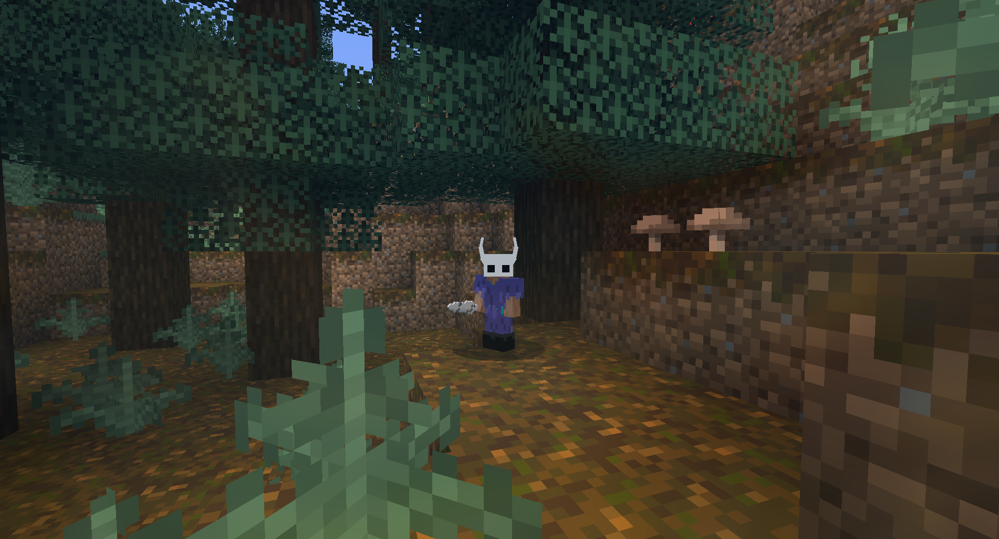
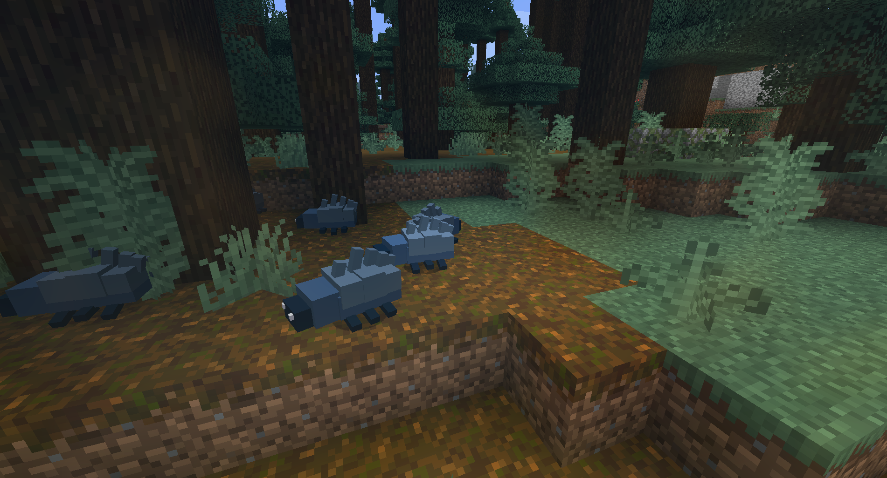
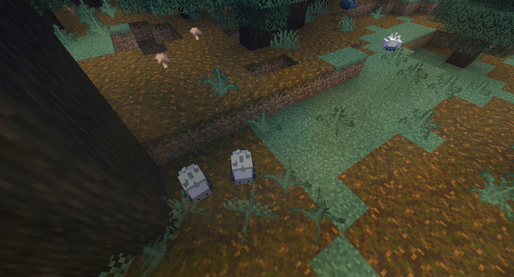

<p align="center">
  
</p>

# Hollow Knight Mod

An unofficial fan-made Minecraft Forge mod inspired by *Hollow Knight*. It
brings Pale Ore, the Knight's equipment, Nail progression, and other
Hallownest-themed content to Minecraft 1.16.5.

## Features

- Pale Ore generates naturally in new Overworld chunks between Y=8 and Y=32.
  Each chunk gets four generation attempts with veins of up to five blocks.
- The Old Nail can be upgraded through all four canonical stages at an anvil.
- Crawtids and Tiktiks spawn underground throughout the Overworld and on the
  surface of forest biomes at night.
- Knight armor uses the supplied armor texture and gives the helmet animated
  3D horns.
- All mod content is collected under a dedicated creative inventory tab.
- Includes a Hallownest-themed music disc and English and Brazilian Portuguese
  translations.

## Screenshots

<p align="center">
  
  <br>
  <sub>Knight armor and Nail in a forest environment</sub>
</p>

<p align="center">
  
  
  <br>
  <sub>Crawtids and Tiktiks</sub>
</p>

## Nail Upgrades

Place the current Nail in the left anvil slot and Pale Ingots in the right
slot. The operation preserves enchantments, durability, and custom names.

| Upgrade | Pale Ingots | XP Levels | Damage |
| --- | ---: | ---: | ---: |
| Old Nail → Sharpened Nail | 1 | 1 | 5 → 9 |
| Sharpened Nail → Channelled Nail | 1 | 2 | 9 → 13 |
| Channelled Nail → Coiled Nail | 2 | 4 | 13 → 17 |
| Coiled Nail → Pure Nail | 3 | 6 | 17 → 21 |

In *Hollow Knight*, the first upgrade costs 250 Geo and no Pale Ore. Since
Geo is not implemented in this mod, that step uses one Pale Ingot. The
remaining Pale Ore requirements follow the original progression.

## Requirements and Installation

- Minecraft 1.16.5
- Minecraft Forge 36.2.34 or newer
- Java 8

Build the project, then copy the generated JAR from `build/libs/` into the
Minecraft `mods/` directory.

## Development

Use the included Gradle wrapper:

```bash
./gradlew build
./gradlew runClient
./gradlew test
```

Java sources are under `src/main/java/com/example/hollowknightmod/`. Models,
textures, translations, and Forge metadata are under `src/main/resources/`.

## Credits

Mod art and development by Kayk Caputo. *Hollow Knight* was created by Team
Cherry. This project is unofficial and is not affiliated with or endorsed by
Team Cherry.
